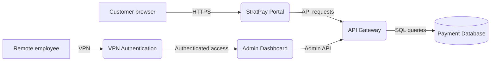
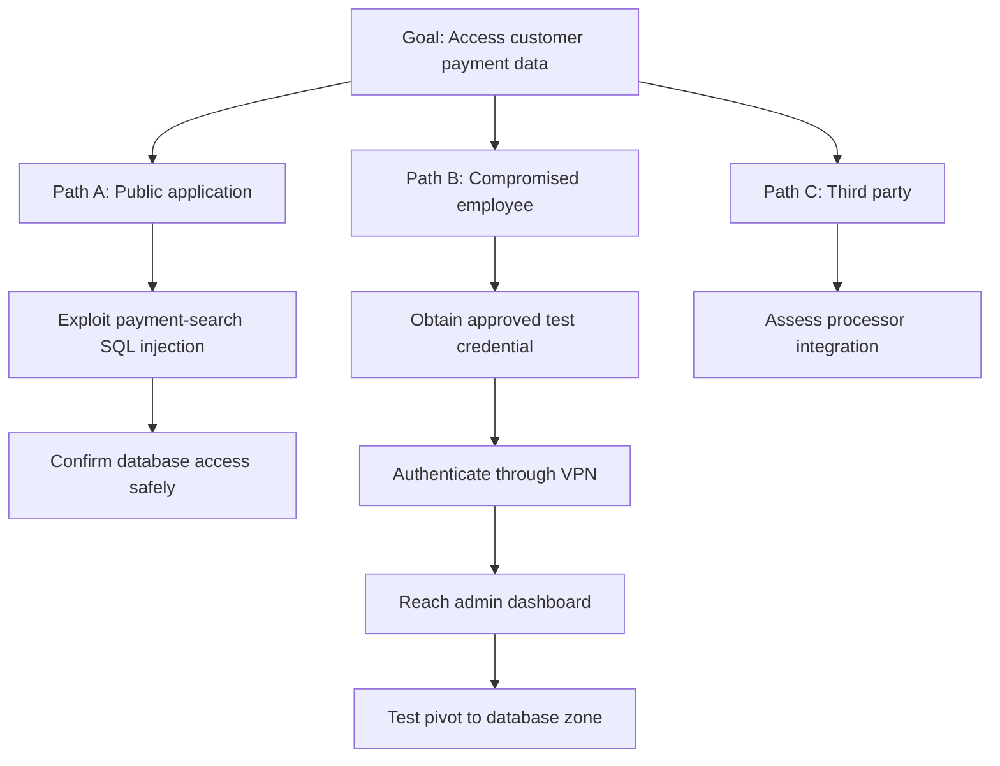

# Threat Modelling for Penetration Testers

> A practical method for turning architecture, business priorities, and adversary intelligence into a focused penetration-test plan.

## Overview

Threat modelling prevents a time-boxed penetration test from becoming an unfocused scan of everything in scope. It identifies what the client values, how those assets are exposed, which attack paths matter most, and where testing time will produce the greatest assurance.

For a penetration tester, a threat model is a **targeting and prioritization document**. It should answer:

1. What must be protected?
2. How does the system work?
3. Where does trust change?
4. What can go wrong?
5. Which threats matter most?
6. Which realistic attack paths should the engagement test?

This lesson uses **Stratford Systems**, a fictional financial-services company, as a running case study.

---

## Learning Objectives

By the end of this lesson, you should be able to:

1. Explain where threat modelling fits in a professional penetration test.
2. Inventory data, system, and business-process assets.
3. Build and interpret Data Flow Diagrams (DFDs).
4. Identify trust boundaries and attack-surface entry points.
5. Apply STRIDE systematically.
6. Use DREAD carefully for workshop triage.
7. Apply PASTA to connect technical threats to business risk.
8. Use MITRE ATT&CK to add real adversary behavior.
9. Convert the result into a prioritized, authorized test plan.

---

# 1. Threat Modelling in the Pentest Lifecycle

The Penetration Testing Execution Standard (PTES) describes seven engagement phases:

1. Pre-engagement interactions
2. Intelligence gathering
3. Threat modelling
4. Vulnerability analysis
5. Exploitation
6. Post-exploitation
7. Reporting

Threat modelling comes after intelligence gathering because you first need evidence about the environment. It comes before active vulnerability analysis because that evidence must be converted into priorities before testing begins.

```text
Scope and authorization
        ↓
Intelligence gathering: What exists?
        ↓
Threat modelling: What matters and what could go wrong?
        ↓
Vulnerability analysis: Which weaknesses may enable those threats?
        ↓
Exploitation: Can the approved attack paths be validated safely?
        ↓
Reporting and retest: What was proven and what was fixed?
```

Threat modelling never expands authorization. A plausible attack path that leaves the signed scope must be recorded as an assumption or follow-up recommendation, not tested without written approval.

## Why This Matters

Imagine a ten-day test covering hundreds of hosts. Blind scanning can consume days on low-value systems while the route to a payment database receives little attention. Threat modelling gives the team a defensible reason to prioritize:

1. Internet-facing entry points.
2. Trust-boundary crossings.
3. Authentication and authorization controls.
4. Paths to critical data and business processes.
5. Scenarios raised by the client or supported by threat intelligence.

---

# 2. The Four Questions

Most threat-modelling approaches can be organized around four questions popularized by Adam Shostack:

| Question | Pentest Meaning | Main Output |
| --- | --- | --- |
| **What are we working on?** | Understand architecture, scope, assets, data flows, and trust boundaries | System model and DFD |
| **What can go wrong?** | Identify threats and realistic abuse cases | Threat inventory |
| **What will we do about it?** | Select testing, prevention, detection, and response actions | Test objectives and recommendations |
| **Did we do a good enough job?** | Review completeness and validate controls | Coverage review and retest plan |

The questions are more important than loyalty to one framework. STRIDE, PASTA, DREAD, and ATT&CK provide different lenses for answering them.

---

# 3. The Stratford Systems Scenario

## Engagement Briefing

| Field | Details |
| --- | --- |
| **Client** | Stratford Systems, Inc. |
| **Industry** | Financial services |
| **Compliance scope** | PCI DSS cardholder-data environment |
| **Engagement** | External penetration test with limited internal pivot authorization |
| **Timeline** | 10 business days |

## Target Systems

1. **StratPay Portal** — public customer payment application.
2. **Internal API Gateway** — connects the portal to backend services.
3. **SQL Server Database Cluster** — stores customer PII and payment records.
4. **Active Directory** — `stratford.local`, used for employee authentication and SSO.
5. **Admin Dashboard** — internal management interface available through VPN.
6. **Employee Directory Service** — LDAP-integrated staff lookup and profiles.

## Authorization Boundaries

1. Public-facing assets may be tested externally.
2. Internal pivoting is permitted only through the VPN using client-provided credentials or credentials obtained through authorized testing.
3. Database queries may confirm access, but bulk extraction is prohibited.
4. Social engineering is limited to five pre-approved employee addresses.

## Primary Business Concern

The CISO wants to know whether a compromised employee credential can provide VPN access and lead to the payment database.

This concern should influence prioritization, but it does not replace systematic analysis. The team should test the stated credential path and other high-risk paths, such as direct SQL injection against the public portal.

---

# 4. Assets, DFDs, Trust Boundaries, and Attack Surface

## Asset Categories

An **asset** is anything valuable to the organization or useful to an attacker.

| Category | Meaning | Stratford Examples |
| --- | --- | --- |
| **Data assets** | Information stored, processed, or transmitted | Cardholder data, PII, credentials, transaction records, audit logs |
| **System assets** | Components that process or protect data | Portal, API gateway, VPN, AD, SQL Server, admin dashboard |
| **Business-process assets** | Activities that create value or satisfy obligations | Payment processing, refunds, customer account management, PCI reporting |

For each asset, record its owner, sensitivity, location, business purpose, dependencies, authorized users, and recovery requirements.

## DFD Elements

A Data Flow Diagram models how data moves through a system.

| Element | Meaning | Example |
| --- | --- | --- |
| **External entity** | User or system outside the modelled control boundary | Customer browser, third-party processor |
| **Process** | Component that transforms or acts on data | StratPay Portal, API gateway |
| **Data store** | Persistent data repository | SQL Server, Active Directory, audit-log store |
| **Data flow** | Communication between elements | HTTPS request, API call, SQL query |
| **Trust boundary** | Point where trust level or authority changes | Internet to DMZ, DMZ to internal network |

## Simplified Stratford DFD



The visual shows components and flows, but the threat model must also label trust boundaries explicitly.

## Stratford Trust Boundaries

| ID | Boundary | Important Crossing Flows |
| --- | --- | --- |
| **TB1** | Internet ↔ DMZ | Customer requests to StratPay |
| **TB2** | DMZ ↔ Internal Network | Portal calls to API Gateway |
| **TB3** | Internal Network ↔ Database Zone | API Gateway queries to SQL Server |
| **TB4** | Internet ↔ VPN Tunnel | Remote authentication and encrypted VPN traffic |
| **TB5** | VPN Tunnel ↔ Internal Network | Authenticated employee access to internal services |

## Why Trust Boundaries Matter

Every boundary crossing requires a decision about identity, authorization, input validity, confidentiality, integrity, and monitoring. These crossings concentrate risk because untrusted or less-trusted data enters a more trusted zone.

For each crossing, ask:

1. How is the source authenticated?
2. What authorizes this exact operation?
3. How is input validated and output constrained?
4. How are confidentiality and integrity protected in transit?
5. What limits volume and resource use?
6. What evidence is logged?
7. What prevents a compromise on one side from becoming a pivot?

## Attack Surface

The attack surface includes every point where an unauthorized actor can submit input, receive output, authenticate, invoke functionality, or cross into a new trust zone.

Examples include:

1. Public forms and APIs.
2. VPN and SSO endpoints.
3. File uploads and webhooks.
4. Admin functions.
5. API Gateway routes.
6. Database connections.
7. LDAP and Active Directory integrations.
8. Logging, monitoring, and management interfaces.

## Useful DFD Tools

1. [OWASP Threat Dragon](https://owasp.org/www-project-threat-dragon/) for security-focused diagrams and threat annotation.
2. Microsoft Threat Modeling Tool for Windows-based structured modelling.
3. Draw.io or Excalidraw for fast collaborative diagrams.

The tool matters less than an accurate model reviewed by people who understand the system.

---

# 5. STRIDE: Systematic Threat Identification

STRIDE is a mnemonic for six threat categories. Each category represents a violated security property.

| Category | Violated Property | Core Question | Typical Pentest Areas |
| --- | --- | --- | --- |
| **Spoofing** | Authentication | Can an attacker impersonate a user, service, or system? | Credential attacks, token flaws, session hijacking, missing MFA |
| **Tampering** | Integrity | Can data, code, or configuration be changed without authorization? | Parameter manipulation, injection, unsigned messages, file modification |
| **Repudiation** | Non-repudiation | Can an actor deny an action because evidence is missing or unreliable? | Weak audit logs, shared accounts, mutable logs, missing timestamps |
| **Information Disclosure** | Confidentiality | Can unauthorized parties obtain protected information? | IDOR, SQL injection, verbose errors, exposed backups, excessive API data |
| **Denial of Service** | Availability | Can legitimate use be degraded or stopped? | Resource exhaustion, expensive queries, queue saturation, crashes |
| **Elevation of Privilege** | Authorization | Can an actor gain capabilities beyond the assigned role? | Broken access control, privilege escalation, admin endpoint exposure |

## DFD-to-STRIDE Mapping

| DFD Element | S | T | R | I | D | E |
| --- | :---: | :---: | :---: | :---: | :---: | :---: |
| **External entity** | ✓ |  | ✓ |  |  |  |
| **Process** | ✓ | ✓ | ✓ | ✓ | ✓ | ✓ |
| **Data flow** |  | ✓ |  | ✓ | ✓ |  |
| **Data store** |  | ✓ | ✓* | ✓ | ✓ |  |

\*Repudiation is particularly relevant when the data store contains audit evidence that can be altered or erased.

Processes receive all six categories because they authenticate, authorize, process input, produce output, consume resources, and often create audit records.

## Two Analysis Styles

### STRIDE per element

Apply every relevant category to every DFD element. This provides broad coverage but can become expensive for large architectures.

### STRIDE per interaction

Focus on communications that cross trust boundaries. This is often efficient for time-boxed penetration tests because it concentrates analysis where security decisions are required.

Use per-element analysis for critical components and per-interaction analysis to cover a large architecture efficiently.

## Stratford Example: StratPay Portal

| STRIDE | Threat Scenario | Test Direction |
| --- | --- | --- |
| **Spoofing** | Stolen credentials or weak sessions allow customer impersonation | Authentication, MFA, session management, credential-stuffing controls |
| **Tampering** | A user changes payment amounts, recipients, or API parameters | Server-side validation, message integrity, mass assignment |
| **Repudiation** | Transactions cannot be attributed reliably | Audit completeness, immutable identifiers, clock consistency |
| **Information Disclosure** | SQL injection or IDOR exposes other customers' records | Injection, object authorization, excessive response data |
| **Denial of Service** | Expensive searches or repeated requests exhaust resources | Rate limits, query bounds, queue and resource controls |
| **Elevation of Privilege** | Customer reaches administrative or refund functions | Function-level authorization and role enforcement |

## STRIDE Limitations

1. It identifies threats but does not prioritize them.
2. It can produce a large checklist in complex systems.
3. It depends on DFD accuracy.
4. It is architecture-focused and may miss changing runtime conditions.
5. It does not by itself establish which adversaries are likely to use a technique.

DREAD, PASTA, and ATT&CK address different parts of these limitations.

---

# 6. DREAD: Lightweight Triage

DREAD provides a quick numerical discussion framework for ranking threats identified through STRIDE.

> **Important:** Microsoft discontinued internal use of DREAD because teams produced inconsistent subjective scores. Use it for transparent workshop triage, not as an objective measurement or a replacement for formal vulnerability scoring.

## The Five Factors

| Factor | Question | High Score Means |
| --- | --- | --- |
| **Damage** | How severe is successful exploitation? | Major compromise, loss, or disruption |
| **Reproducibility** | How consistently can the attack be repeated? | Reliable and scriptable |
| **Exploitability** | How much skill, access, and tooling are required? | Easy, unauthenticated, mature tooling |
| **Affected Users** | How broad or important is the affected population? | Many users or critical roles |
| **Discoverability** | How easily can the weakness be found? | Obvious or automatically detectable |

## Formula

```text
DREAD Score = (Damage + Reproducibility + Exploitability
               + Affected Users + Discoverability) / 5
```

If each factor is scored from 1 to 10, a local workshop might use:

| Average | Local Rating |
| --- | --- |
| 9.0–10.0 | Critical |
| 7.0–8.9 | High |
| 4.0–6.9 | Medium |
| 1.0–3.9 | Low |

These bands are a team convention, not a universal standard. Document the scale and apply it consistently.

## Discoverability Caveat

Some teams remove Discoverability or always score it highly because obscurity is not a durable defense. Others retain it because discoverability affects likelihood in the current context. Choose one policy before scoring and record it.

## Example Comparison

| Threat | D | R | E | A | Di | Average | Priority |
| --- | ---: | ---: | ---: | ---: | ---: | ---: | --- |
| Public payment-search SQL injection | 9 | 8 | 7 | 9 | 8 | 8.2 | High |
| VPN-only verbose admin errors | 3 | 10 | 9 | 2 | 6 | 6.0 | Medium |

The numbers do not make the judgment objective. Their value is that they expose the assumptions behind the ranking.

## DREAD vs. CVSS

| DREAD | CVSS |
| --- | --- |
| Fast workshop triage | Formal vulnerability severity scoring |
| Threat-scenario focused | Vulnerability-characteristic focused |
| Highly subjective | More standardized metrics and definitions |
| Useful before or during testing | Common in professional findings and vulnerability management |

Use DREAD to prioritize hypotheses. Use the current CVSS specification, client risk context, and business impact when rating validated findings.

---

# 7. PASTA: Business-Risk-Driven Threat Modelling

PASTA stands for **Process for Attack Simulation and Threat Analysis**. It starts with business objectives and progressively connects them to technical scope, threats, vulnerabilities, attack paths, and impact.

## Seven Stages

| Stage | Question | Stratford Output |
| --- | --- | --- |
| **1. Define Objectives** | What must the business protect and why? | PCI DSS, customer trust, transaction availability |
| **2. Define Technical Scope** | Which technologies and systems support those objectives? | Portal, API Gateway, SQL, AD, VPN, dashboard |
| **3. Application Decomposition** | How does data move and where does trust change? | DFD, entry points, data stores, trust boundaries |
| **4. Threat Analysis** | Which threats are realistic for this organization? | Credential theft, payment fraud, API abuse, data theft |
| **5. Vulnerability Analysis** | Which weaknesses could enable those threats? | SQL injection, default credentials, weak MFA, excessive access |
| **6. Attack Modelling** | How can threats and weaknesses form complete attack paths? | External injection path and credential-to-database path |
| **7. Risk and Impact Analysis** | What happens to the business if a path succeeds? | Cardholder exposure, regulatory costs, downtime, loss of trust |

## PASTA Attack Tree



Path C may be relevant but outside scope. It belongs in the model as a risk and assumption, not in active testing unless the client authorizes it.

## STRIDE vs. PASTA

| Dimension | STRIDE | PASTA |
| --- | --- | --- |
| **Primary question** | What can go wrong with this component? | What attack paths threaten this business? |
| **Starting point** | Architecture and DFD | Business objectives |
| **Perspective** | Systematic security properties | Risk-centric attacker simulation |
| **Output** | Categorized threat inventory | Prioritized attack scenarios and impacts |
| **Best fit** | Fast structured identification | Risk-driven scoping and test planning |
| **Time** | Hours for a bounded system | Days or longer for a full assessment |

They work well together: use STRIDE within PASTA's threat-analysis stage, then use later PASTA stages to build and prioritize complete attack paths.

---

# 8. MITRE ATT&CK: Threat-Informed Test Planning

MITRE ATT&CK is a knowledge base of adversary behavior observed in real intrusions. It organizes behavior into:

1. **Tactics** — the adversary's objective, or *why*.
2. **Techniques** — the method used to achieve that objective, or *how*.
3. **Sub-techniques** — a more specific implementation of a technique.

The Enterprise matrix contains 14 tactics:

1. Reconnaissance
2. Resource Development
3. Initial Access
4. Execution
5. Persistence
6. Privilege Escalation
7. Defense Evasion
8. Credential Access
9. Discovery
10. Lateral Movement
11. Collection
12. Command and Control
13. Exfiltration
14. Impact

> **Version note:** The supplied room material referenced ATT&CK v18. The official current release at the time this note was prepared, September 2026, is v19.2. ATT&CK changes over time, so verify technique names, tactics, and mappings on the official site before formal reporting.

## ATT&CK-Based Workflow

1. Identify threat groups and campaigns relevant to the client's industry and geography.
2. Identify techniques relevant to the platforms and services in scope.
3. Create ATT&CK Navigator layers for each intelligence lens.
4. Overlay the layers to identify repeated, evidence-backed techniques.
5. Compare those techniques with existing prevention and detection controls.
6. Convert gaps into authorized test objectives.

ATT&CK adds evidence to a theoretical threat. STRIDE may show that spoofing is possible at the VPN boundary; ATT&CK can show that relevant adversaries use stolen accounts and external remote services in real operations.

## Useful Tools

1. [MITRE ATT&CK Navigator](https://mitre-attack.github.io/attack-navigator/) for technique layers and overlays.
2. [CISA Decider](https://github.com/cisagov/Decider/) for mapping observed behavior to ATT&CK.
3. [Atomic Red Team](https://github.com/redcanaryco/atomic-red-team) for controlled technique-level tests where the RoE allows them.

## ATT&CK Mapping Discipline

Map what actually happens, not what sounds close. A tactic describes the objective of that action, and a technique describes the behavior.

| Stratford Action | Defensible Mapping | Important Distinction |
| --- | --- | --- |
| Send malicious attachment | Initial Access — Spearphishing Attachment (`T1566.001`) | Delivery of the lure is initial access behavior |
| Capture a password through a fake login page | Credential Access — Input Capture: Web Portal Capture (`T1056.003`) | `T1078` describes using an account, not harvesting it |
| Use stolen domain credentials | Valid Accounts: Domain Accounts (`T1078.002`) | Can support Initial Access, Persistence, Privilege Escalation, or Defense Evasion |
| Enter the network through VPN | Initial Access/Persistence — External Remote Services (`T1133`) | Often combined with Valid Accounts |
| Move to another host using RDP, SSH, or SMB | Lateral Movement — Remote Services (`T1021`) | Merely viewing a web dashboard is not automatically lateral movement |
| Query a database and stage its records | Collection — often Data from Local System (`T1005`), depending on behavior | Collection is separate from transfer outside the environment |
| Send staged data through an existing C2 channel | Exfiltration — Exfiltration Over C2 Channel (`T1041`) | `T1041` requires an actual C2 channel |

This corrects a common shortcut in classroom exercises: **credential collection, use of credentials, database collection, and external exfiltration are separate behaviors and should not be collapsed into one step.**

---

# 9. Combined Pentester Workflow

The frameworks are complementary:

| Layer | Framework or Artifact | Question | Output |
| --- | --- | --- | --- |
| **Architecture** | Assets + DFD | What are we working on? | Components, flows, boundaries |
| **Threat identification** | STRIDE | What security property could fail? | Threat inventory |
| **Fast triage** | DREAD | Which hypotheses deserve attention first? | Transparent workshop ranking |
| **Business risk** | PASTA | Which attack paths threaten business objectives? | Risk-driven scenarios |
| **Adversary evidence** | MITRE ATT&CK | How do real adversaries behave? | Technique-informed test objectives |
| **Execution control** | SOW + RoE | What may we safely test? | Authorized test plan |

## Ten-Step Process

1. Read the SOW, RoE, scope, exclusions, and stop conditions.
2. Record the client's primary concerns and business objectives.
3. Inventory data, systems, identities, and business processes.
4. Build or validate the DFD and mark every trust boundary.
5. Apply STRIDE to critical elements and boundary-crossing interactions.
6. Enrich threats with industry, platform, and ATT&CK evidence.
7. Use DREAD or another documented method for initial triage.
8. Build PASTA-style attack paths connecting entry points to business impact.
9. Convert in-scope paths into bounded test objectives and evidence requirements.
10. Review coverage, assumptions, untested risks, and retest criteria with the client.

---

# 10. Stratford Guided Exercise

## Step 1: Review the DFD

Confirm all five boundaries and the flows crossing them:

1. TB1 — Internet to DMZ.
2. TB2 — DMZ to internal network.
3. TB3 — Internal network to database zone.
4. TB4 — Internet to VPN tunnel.
5. TB5 — VPN tunnel to internal network.

## Step 2: Apply STRIDE

| Component | Greatest Stated Risk | Reasoning |
| --- | --- | --- |
| VPN Authentication Service | **Spoofing** | Stolen credentials may impersonate an employee |
| API Gateway ↔ SQL Server flow | **Information Disclosure** | The flow carries regulated customer and payment data |
| Admin Dashboard | **Elevation of Privilege** | A standard user may reach refund or account-management functions |
| Audit Log Store | **Repudiation** | Missing or mutable records prevent reliable attribution |

Other STRIDE categories can also apply. The exercise asks for the greatest risk in the supplied scenario, not the only possible category.

## Step 3: Prioritize the Four Threats

A reasonable engagement ranking is:

1. **Public payment-search SQL injection** — direct path to the cardholder-data environment with very high impact.
2. **Default API Gateway management credentials** — trivial exploitation may provide privileged middleware access and a path inward.
3. **Stored XSS in customer feedback** — affects other users and may enable session or action abuse, but the exact impact depends on session controls and victim roles.
4. **VPN-only verbose admin errors** — useful enabling information, but lower direct impact and narrower reach.

This ordering must be confirmed against actual DREAD scores, existing controls, scope, and evidence. If the default management interface is Internet-accessible, for example, it may become the highest priority.

## Step 4: Correctly Layer ATT&CK

A more precise chain is:

| Step | Tactic | Technique |
| --- | --- | --- |
| Deliver malicious attachment | Initial Access | Spearphishing Attachment (`T1566.001`) |
| Capture credentials through a phishing page or input hook | Credential Access | Select the technique matching the observed capture method, such as `T1056.003` |
| Authenticate to VPN using the stolen account | Initial Access / Persistence | External Remote Services (`T1133`) plus Valid Accounts (`T1078`) |
| Move to another internal host through a remote service | Lateral Movement | Remote Services (`T1021`) |
| Query and stage payment records | Collection | Technique depends on the collection method; often `T1005` for data collected from a system |
| Transfer records over the established C2 channel | Exfiltration | Exfiltration Over C2 Channel (`T1041`) |

## Step 5: Prioritize the Test Plan

Recommended order:

1. **Objective A:** Test the public transaction-search feature for SQL injection.
2. **Objective B:** Test whether authorized simulated-phishing credentials grant VPN access and whether MFA blocks reuse.
3. **Objective C:** Test whether an authenticated VPN user can reach the dashboard and traverse toward the database within the approved pivot path.
4. **Objective D:** Test dashboard role-based access control for refund and privileged account actions.

Objectives B and C directly answer the CISO's primary concern. Objective A remains first because it may offer an unauthenticated, direct path to the highest-value data.

---

# 11. Test Objective Template

```markdown
## Test Objective: [Short name]

- Business concern:
- Assets at risk:
- In-scope components:
- Entry point:
- Trust boundaries crossed:
- Threat scenario:
- STRIDE category:
- ATT&CK mapping:
- Preconditions:
- Authorized actions:
- Prohibited actions:
- Stop conditions:
- Evidence required:
- Success criteria:
- Existing controls to validate:
- Business impact if successful:
- Reporting priority:
```

## Example

```markdown
## Test Objective: Compromised employee credential to payment database

- Business concern: Can one stolen employee account reach cardholder data?
- Assets at risk: AD identity, admin dashboard, customer payment records
- Entry point: Internet-facing VPN
- Trust boundaries crossed: TB4, TB5, TB3
- STRIDE category: Spoofing, Elevation of Privilege, Information Disclosure
- ATT&CK mapping: T1078, T1133, and any validated lateral-movement/collection behaviors
- Preconditions: Client-approved test account or credential captured during the approved simulation
- Authorized actions: VPN login, access-control checks, bounded internal pivot, minimal database query
- Prohibited actions: Bulk extraction, destructive modification, out-of-scope hosts
- Stop conditions: Account lockout, instability, unexpected sensitive access, or client instruction
- Success criteria: Demonstrate whether each control blocks or permits the next step
- Evidence: Timestamps, sanitized screenshots, request/response metadata, affected roles, control behavior
- Business impact: Potential path from one compromised employee to regulated customer data
```

---

# 12. Common Mistakes

1. Scanning before understanding scope and business priorities.
2. Treating an incomplete architecture diagram as authoritative.
3. Forgetting identities, management planes, logs, third parties, and error flows.
4. Applying STRIDE as a checkbox without concrete abuse cases.
5. Treating DREAD scores as objective facts.
6. Rating hypothetical threats and validated vulnerabilities as if they were the same.
7. Mapping ATT&CK based only on keywords instead of observed behavior.
8. Using ATT&CK technique IDs without checking the current official version.
9. Testing a realistic but out-of-scope attack path.
10. Prioritizing only technical severity and ignoring business impact.
11. Failing to record validated controls and blocked paths.
12. Omitting assumptions, coverage gaps, and untested risks from the report.

---

# Key Takeaways

1. A threat model turns a broad scope into a prioritized penetration-test plan.
2. Assets, DFDs, data flows, and trust boundaries form the foundation.
3. STRIDE identifies categories of failure.
4. DREAD can support quick triage, but its numbers are subjective.
5. PASTA connects technical attack paths to business objectives and impact.
6. MITRE ATT&CK adds evidence from real adversary behavior.
7. The SOW and RoE remain the final authority over what may be tested.
8. Good reporting includes successful paths, blocked paths, assumptions, gaps, and retest criteria.

---

## References

- [Penetration Testing Execution Standard](http://www.pentest-standard.org/)
- [Threat Modeling Manifesto](https://www.threatmodelingmanifesto.org/)
- [OWASP Threat Dragon](https://owasp.org/www-project-threat-dragon/)
- [MITRE ATT&CK](https://attack.mitre.org/)
- [MITRE ATT&CK Version History](https://attack.mitre.org/resources/versions/)
- [ATT&CK Navigator](https://mitre-attack.github.io/attack-navigator/)
- [CISA Decider](https://github.com/cisagov/Decider/)
- [Atomic Red Team](https://github.com/redcanaryco/atomic-red-team)
- [FIRST CVSS](https://www.first.org/cvss/)
- [Related: AI Threat Modelling](../../ai-security/ai-threat-modelling.md)
- [Threat Modelling for Penetration Testers Cheat Sheet](../../cheatsheets/threat-modelling-for-pentesters.md)
