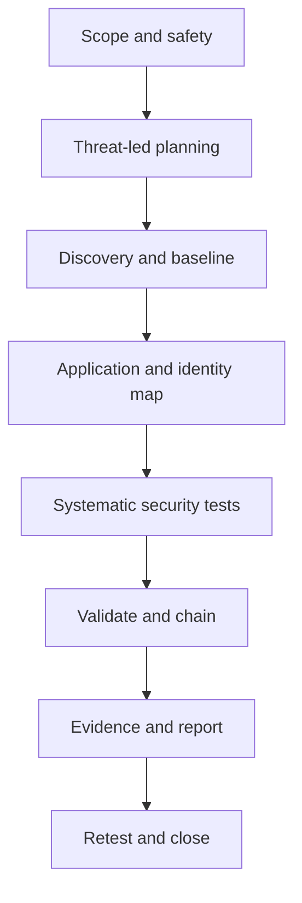

# Web Application Penetration Testing Methodology

> A repeatable, threat-led process for authorized web application tests—from scope and attack-surface mapping to evidence, reporting, and retesting.

## Purpose

A good web pentest is not a collection of payloads. It is a structured attempt to answer:

1. What is exposed?
2. What matters to the business?
3. Which identities, objects, actions, and trust boundaries exist?
4. How could an attacker cross those boundaries or abuse a workflow?
5. Can the result be reproduced, explained, and fixed?

Use this note as the full process. Use the [Web Pentesting Cheat Sheet](../../cheatsheets/web.md) during testing, [Web Walking](../../web-security/web-walking.md) for manual discovery, and [Vulnerability Knowledge](../../web-security/vulnerability-knowledge.md) when investigating a specific vulnerability class.

## Rules Before Tools

Only test systems for which you have explicit authorization. The Rules of Engagement (RoE) override every command and suggestion in these notes.

Confirm before testing:

- In-scope hosts, domains, IPs, APIs, mobile backends, and third parties
- Allowed dates, hours, source IPs, and scan rates
- Production safety restrictions and forbidden techniques
- Test accounts and roles available
- Whether automated scanning, password testing, file upload, denial-of-service, social engineering, or data modification is allowed
- Data-handling rules, evidence retention, and approved communication channels
- Stop conditions and emergency contacts
- Whether proof of access is enough or controlled exploitation is permitted

Never assume a TryHackMe/CTF scan rate is appropriate for a client system. Start conservatively and increase only within the RoE.

## End-to-End Workflow



The phases are ordered, but the process is iterative. A new hostname, role, endpoint, or trust boundary should be added to the model and may change test priorities.

---

## Phase 0 — Prepare the Engagement

### Build an application inventory

Create one row per independently behaving application or service. Different virtual hosts, ports, API versions, and admin panels may require separate rows.

| ID | URL / host | Environment | Purpose | Authentication | Roles | Sensitive assets | Scope | Priority |
|---|---|---|---|---|---|---|---|---|
| APP-01 | `https://portal.example.test` | Production | Customer payments | Local + MFA | Customer, support, admin | PII, payment data | In | Critical |

### Prepare evidence storage

Suggested structure:

```text
engagement/
├── 00-scope/
├── 01-recon/
├── 02-mapping/
├── 03-requests/
├── 04-screenshots/
├── 05-findings/
└── 06-cleanup/
```

Record timestamps in UTC, target details, tool versions, configuration, and any changes made to the target.

## Phase 1 — Threat-Led Planning

Threat modelling decides where limited test time creates the most value.

For each application:

1. Identify business-critical assets: credentials, PII, payment data, secrets, money movement, privileged actions, source code, and availability.
2. Draw the main components and data flows: browser, reverse proxy, application, API, identity provider, queues, storage, and third-party services.
3. Mark trust boundaries: Internet/DMZ, user/admin, tenant/tenant, application/database, and first-party/third-party.
4. Identify likely abuse cases using STRIDE, business logic, and relevant threat intelligence.
5. Turn the highest-risk paths into test objectives.

Example attack path:

```text
Password reset weakness → customer takeover → stored payment method abuse → PII disclosure
```

See [Threat Modelling for Pentesters](../foundations/threat-modelling-for-pentesters.md) for the full DFD, STRIDE, DREAD, PASTA, and MITRE ATT&CK workflow.

## Phase 2 — Passive Reconnaissance

Collect information without interacting heavily with the application:

- DNS records and certificate transparency logs
- Search-engine results and cached pages
- Historical URLs and archived JavaScript
- Public repositories, documentation, package files, and exposed secrets
- Technology clues in job posts, error reports, and public documentation
- Known acquisitions, alternate brands, and third-party portals

Treat passive findings as leads, not facts. Confirm ownership and scope before touching newly discovered assets.

## Phase 3 — Active Discovery and Baseline

### Discover exposed services

Identify web services on standard and non-standard ports. Confirm every target against scope before scanning.

```bash
nmap -Pn -sV --open -p- --min-rate "$RATE" "$TARGET" -oA web-ports
```

`$RATE` must be selected for the environment and RoE. A slower scan is often the professional default.

### Baseline every application

Record:

- Scheme, hostname, port, resolved IP, and environment
- Status code, page title, redirect chain, and response size
- Server and framework indicators from multiple independent signals
- TLS configuration and certificate names
- Security headers and cookie attributes
- `robots.txt`, `sitemap.xml`, well-known paths, and API documentation
- Default error responses and a random nonexistent path

Useful commands:

```bash
curl -iskL --max-redirs 5 "https://$HOST/"
curl -isk "https://$HOST/robots.txt"
curl -isk "https://$HOST/sitemap.xml"
whatweb -a 3 "https://$HOST/"
```

Do not treat a banner as definitive version evidence. Correlate headers, assets, behavior, package metadata, and authenticated pages.

## Phase 4 — Map the Application Through Burp and the Browser

Burp Suite is the working notebook for manual web testing:

- **Proxy / HTTP history:** observe real browser traffic
- **Target / Site map:** build the endpoint inventory
- **Repeater:** change one variable at a time and reproduce behavior
- **Comparer:** identify subtle differences between responses
- **Decoder:** inspect encodings and tokens
- **Intruder:** use carefully for small, authorized test sets

Do not run broad automated scans unless they are authorized and tuned for the target.

### Walk every reachable workflow

Browse as each available identity:

- Unauthenticated visitor
- Normal user
- A second normal user
- Privileged or administrative user
- Different tenant, organization, or account where applicable

Capture registration, login, logout, recovery, profile, search, upload, checkout, administration, API, error, and state-changing flows.

### Build an endpoint inventory

| ID | Method | Path | Auth state / role | Inputs | Objects | State change | Source | Notes |
|---|---|---|---|---|---|---|---|---|
| EP-01 | GET | `/api/orders/{id}` | Customer | Path: `id` | Order | No | Browser | Ownership check required |
| EP-02 | POST | `/api/refunds` | Support | JSON body | Payment | Yes | JavaScript | High business impact |

Include endpoints discovered in JavaScript, source maps, API specifications, mobile traffic, WebSockets, GraphQL, and historical archives.

## Phase 5 — Content and Virtual-Host Discovery

Use wordlist discovery to supplement manual mapping, not replace it.

```bash
ffuf -u "https://$HOST/FUZZ" -w "$WORDLIST" -ac
ffuf -u "https://$HOST/FUZZ" -w "$WORDLIST" -e .php,.asp,.aspx,.jsp,.json,.txt,.bak,.zip -ac
ffuf -u "https://$IP/" -H "Host: FUZZ.$DOMAIN" -w "$SUBDOMAINS" -ac
```

Before trusting results:

- Request a random nonexistent path and note its status, length, words, lines, and redirect behavior
- Filter wildcard and soft-404 responses
- Compare authenticated and unauthenticated discovery
- Re-run focused lists using technology and business vocabulary
- Record `200`, redirects, `401`, and `403`; forbidden content still reveals attack surface
- Treat each distinct virtual host as a separate application

## Phase 6 — Authentication and Session Management

Test the complete identity lifecycle:

### Account creation and login

- Username/email enumeration through content, status, timing, or recovery behavior
- Password policy and known-password controls
- Rate limiting, lockout, throttling, and monitoring
- MFA enrollment, bypass, recovery, replay, and downgrade paths
- Alternate login endpoints, APIs, legacy portals, and mobile flows
- Default, shared, test, and dormant accounts where authorized

### Password reset and account recovery

- Token strength, expiry, single use, and invalidation
- Host-header or forwarded-header poisoning
- User-controlled reset destination
- Security questions and help-desk workflows
- Session invalidation after password change

### Sessions

- Session rotation after login and privilege changes
- Fixation, replay, concurrent sessions, idle timeout, absolute timeout, and logout invalidation
- Cookie flags: `Secure`, `HttpOnly`, `SameSite`, appropriate domain/path, and lifetime
- CSRF protections on state-changing operations
- Tokens in URLs, logs, browser storage, referrers, or caches

### Federated identity and tokens

For OAuth/OIDC/SAML/JWT, test the protocol and the application integration: redirect URI validation, state/nonce, audience, issuer, signature verification, claim trust, key selection, token lifetime, and privilege mapping.

## Phase 7 — Authorization: Role × Object × Action

Authorization is not one test. Model it as a matrix.

| Role | Object | Read | Create | Update | Delete | Privileged action |
|---|---|---:|---:|---:|---:|---:|
| Anonymous | Customer profile | No | No | No | No | No |
| Customer A | Own order | Yes | Yes | Limited | Limited | No |
| Customer A | Customer B order | No | No | No | No | No |
| Support | Customer account | Yes | No | Limited | No | Refund ≤ limit |
| Admin | Customer account | Yes | Yes | Yes | Yes | Yes |

Test:

- **Horizontal access:** same role, another user's or tenant's object
- **Vertical access:** lower role invokes higher-role functions
- **Context access:** valid action performed outside its permitted state, tenant, region, or workflow
- IDs in paths, queries, JSON bodies, forms, headers, cookies, and nested objects
- Hidden UI functions by sending requests directly
- Bulk endpoints, exports, search, and indirect references

Use at least two users whenever possible. Compare the exact request and change only the identity, object, or action under test.

## Phase 8 — Input and Injection Testing

For every controllable input, record where it is processed and where it appears.

Test relevant contexts:

- SQL, NoSQL, LDAP, XPath, and operating-system commands
- Reflected, stored, and DOM-based XSS
- Server-side template injection
- Path traversal and local/remote file inclusion
- SSRF and server-side URL fetching
- XML external entities
- Unsafe deserialization and prototype pollution
- HTTP header injection, request splitting/smuggling indicators, and open redirects
- Email, PDF, CSV, Markdown, and other downstream interpreters

Start with harmless differential probes. Escalate only enough to demonstrate impact and only when permitted. A response change is a lead; reproducible control over behavior is evidence.

## Phase 9 — File Handling

Test upload and download paths together:

- Extension, MIME type, magic bytes, and content validation
- Filename normalization, traversal, collisions, overwrites, and Unicode edge cases
- Storage location, direct access, authorization, cache behavior, and execution
- Image/document processing and metadata
- Archive extraction and decompression behavior
- Malware scanning and quarantine workflow where in scope
- Predictable or unauthenticated download identifiers

Use benign proof files. Do not upload destructive payloads or persistent code unless explicitly authorized.

## Phase 10 — API Security

Map REST, GraphQL, SOAP, WebSocket, and undocumented application APIs.

Check:

- Object-level authorization (BOLA/IDOR)
- Function-level and property-level authorization
- Mass assignment and over-posting
- Excessive data exposure
- Authentication differences between UI and API
- Method confusion and undocumented methods
- Rate limits, pagination, batch endpoints, and resource exhaustion
- Version drift and deprecated endpoints
- CORS and browser credential behavior
- Schema discovery, introspection, subscriptions, and nested query limits for GraphQL
- WebSocket authentication, origin validation, message authorization, and token expiry

## Phase 11 — Browser and Client-Side Security

- DOM sources and dangerous sinks
- CSP effectiveness, not just header presence
- Clickjacking and framing policy
- CORS allowlists, credentials, null origin, and preflight behavior
- Secrets and sensitive data in JavaScript, source maps, browser storage, caches, and service workers
- `postMessage` origin and message validation
- Third-party scripts and subresource integrity where appropriate
- Client-side enforcement that lacks a server-side control

## Phase 12 — Business Logic and Race Conditions

Business logic flaws often survive scanners because each request is technically valid.

Ask:

- Can steps be skipped, reordered, replayed, or repeated?
- Can price, quantity, currency, discount, shipping, limits, or account state be manipulated?
- Can one-time actions be used twice?
- Can refunds, credits, votes, invitations, or approvals exceed policy?
- Can concurrent requests defeat balances, stock, quotas, or idempotency?
- Can a lower-privileged employee combine allowed actions to reach a forbidden outcome?
- What happens at zero, negative, maximum, duplicate, stale, and cross-tenant values?

Build workflow diagrams for critical actions and test every transition, not only each endpoint.

## Phase 13 — Configuration, Components, and Known Vulnerabilities

- Default credentials and exposed management interfaces
- Debug mode, stack traces, backups, source maps, directory listing, and verbose errors
- Security headers, TLS, HTTP methods, caching, and reverse-proxy behavior
- Framework, server, plugin, package, and client-library versions
- Cloud storage, metadata services, CI/CD artifacts, and secrets

Before attempting a public exploit:

1. Confirm the product and version using multiple signals.
2. Read the primary advisory and identify affected configurations.
3. Confirm authentication, platform, module, and feature preconditions.
4. Choose the least destructive proof.
5. Record why the target is or is not vulnerable.

## Phase 14 — Validate Impact and Chain Findings

A pentest demonstrates business risk, not maximum damage.

- Prefer the smallest proof that establishes impact
- Use synthetic records where possible
- Do not bulk-download sensitive data when a single controlled record proves access
- Stop at agreed boundaries
- Track accounts, files, tokens, callbacks, and data created during testing
- Look for chains: information leak → credential compromise → authorization bypass → sensitive action

If a test could affect availability, integrity, customer data, or money movement, pause and confirm authorization before proceeding.

## Phase 15 — Evidence, Reporting, and Retesting

Capture evidence while testing, not from memory at the end.

### Evidence record

| Field | Record |
|---|---|
| Finding ID | Stable identifier |
| Timestamp | UTC |
| Target | Host, port, URL, environment |
| Identity | User, role, tenant, session state |
| Preconditions | Required access and state |
| Request | Sanitized raw request or reproducible command |
| Response | Relevant sanitized excerpt and status |
| Expected result | Intended security behavior |
| Actual result | Observed behavior |
| Impact | Technical and business consequence |
| Cleanup | Data/accounts/files removed or retained |

### Finding structure

Each report finding should include:

1. Title and severity
2. Affected assets and endpoints
3. Description and root cause
4. Preconditions
5. Reproduction steps
6. Evidence
7. Technical and business impact
8. Likelihood and severity rationale
9. Specific remediation
10. References and mapping where useful

During retesting, use the original reproduction steps, verify the control server-side, check for alternate paths, and record whether the issue is fixed, partially fixed, or still present.

## Coverage Tracker

Use `Not started`, `In progress`, `Tested`, `Finding`, `Blocked`, or `Not applicable`.

| Area | Anonymous | User A | User B | Privileged | Notes |
|---|---|---|---|---|---|
| Authentication |  |  |  |  |  |
| Session management |  |  |  |  |  |
| Authorization |  |  |  |  |  |
| Input handling |  |  |  |  |  |
| File handling |  |  |  |  |  |
| API |  |  |  |  |  |
| Browser/client |  |  |  |  |  |
| Business logic |  |  |  |  |  |
| Configuration |  |  |  |  |  |

`Blocked` is valuable. State what prevented the test: missing account, unavailable feature, out-of-scope dependency, production risk, or time constraint.

## Time-Boxing a Web Pentest

A practical allocation for a short engagement:

| Effort | Focus |
|---:|---|
| 10% | Scope, threat model, setup |
| 20% | Discovery and application mapping |
| 40% | Systematic control and workflow testing |
| 15% | Validation and attack chaining |
| 15% | Reporting, cleanup, and coverage review |

Adjust toward the highest-value attack paths. Do not spend half the engagement fuzzing static paths while critical authenticated workflows remain untested.

## When You Get Stuck

Return to the model:

1. Did I find every application, hostname, port, API version, and role?
2. Did I compare anonymous, two peer users, and a privileged user?
3. Did I inspect JavaScript, source maps, archived URLs, API schemas, and browser traffic?
4. Did I test every state-changing workflow and trust-boundary crossing?
5. Did I vary identity, object, action, state, sequence, and timing independently?
6. Did I investigate unusual `401`, `403`, redirects, errors, and response-size differences?
7. Is the highest-risk business path fully tested, or am I following the easiest technical lead?

## Common Failure Modes

- Scanning before confirming scope and rate limits
- Treating automated scanner output as a verified finding
- Testing vulnerability classes without mapping workflows and roles
- Using only one account for authorization tests
- Ignoring APIs because the browser UI hides them
- Reporting version banners without proving affected conditions
- Calling every non-`404` path valid without filtering soft 404s
- Collecting screenshots without preserving requests, responses, identity, and state
- Proving technical behavior without explaining business impact
- Failing to remove test artifacts or document cleanup

## Reference Frameworks

- [OWASP Web Security Testing Guide](https://owasp.org/www-project-web-security-testing-guide/)
- [OWASP Top 10](https://owasp.org/www-project-top-ten/)
- [OWASP API Security Project](https://owasp.org/www-project-api-security/)
- [PortSwigger Web Security Academy](https://portswigger.net/web-security)
- [PTES Technical Guidelines](http://www.pentest-standard.org/index.php/PTES_Technical_Guidelines)

## Related Notes

- [Web Pentesting Cheat Sheet](../../cheatsheets/web.md)
- [Web Walking](../../web-security/web-walking.md)
- [Vulnerability Knowledge](../../web-security/vulnerability-knowledge.md)
- [Threat Modelling for Pentesters](../foundations/threat-modelling-for-pentesters.md)
- [Reconnaissance](../reconnaissance/reconnaissance-methodology.md)
- [Python for Pentesting](../../python-for-pentesting/README.md)
